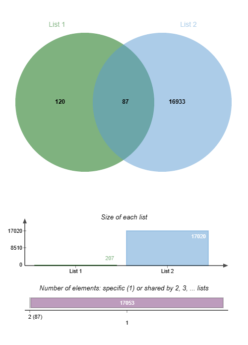
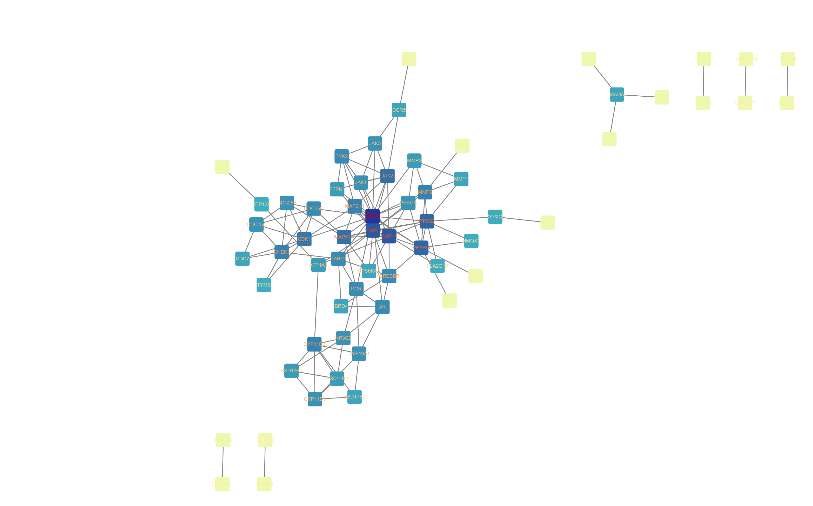
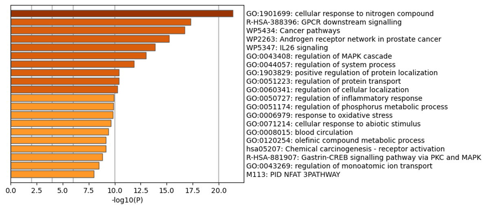

# 🧬 Andrographolide vs Head and Neck Cancer
### A Network Pharmacology & Molecular Docking Pipeline

**Author:** Vaibhav Bhujbal  
**Field:** Computational Biology / Zoology  
**Location:** Maharashtra, India  
**Contact:** bhujbalv9553@gmail.com

---

## 📌 About This Project

Andrographolide is a natural compound from *Andrographis paniculata*,
a medicinal plant used in Ayurvedic medicine. This project uses free 
online bioinformatics tools to systematically identify which cancer 
proteins it may target in head and neck cancer (HNC) — and validates 
those predictions against real Indian patient data (GSE23558).

> 💡 This is the first computational study to validate andrographolide 
> targets specifically against Indian OSCC patient data.

---

## 🔬 Pipeline Overview
Andrographolide → ADMET → Target Prediction → Disease Genes
→ Common Targets (87) → PPI Network → Pathway Analysis
→ Patient Validation (GEO) → Molecular Docking

---

## 📋 Step-by-Step Pipeline

### Step 1 — Drug Profiling
| | |
|---|---|
| **Tools** | SwissADME, pkCSM |
| **Goal** | Check if andrographolide is orally drug-like |
| **Result** | ✅ Passed all Lipinski criteria, 0 violations |
| **Key values** | MW = 350.45 Da, LogP = 1.56, TPSA = 86.99 Ų |

### Step 2 — Target Prediction
| | |
|---|---|
| **Tools** | SwissTargetPrediction, SuperPred |
| **Goal** | Predict which human proteins andrographolide may bind |
| **Result** | 207 putative targets identified |

### Step 3 — Disease Gene Collection
| | |
|---|---|
| **Tools** | GeneCards, OMIM, Open Targets Platform |
| **Goal** | Collect all genes associated with HNC |
| **Result** | 17,020 disease genes collected |

### Step 4 — Common Target Identification
| | |
|---|---|
| **Tool** | Microsoft Excel (COUNTIF function) |
| **Goal** | Find overlap between drug targets and disease genes |
| **Result** | ✅ 87 shared targets identified |

### Step 5 — PPI Network Construction
| | |
|---|---|
| **Tools** | STRING v12.0, Cytoscape v3.10.2 |
| **Settings** | Confidence score > 0.700 |
| **Goal** | Build protein interaction network, identify hub genes |
| **Result** | 62 nodes, 130 edges, 10 hub genes identified |

**10 Hub Genes:**
EGFR | MAPK1 | MAPK3 | PPARG | PTGS2
JAK2 | MAPK14 | CDK1 | CYP11B2 | CHEK1

### Step 6 — Pathway Enrichment Analysis
| | |
|---|---|
| **Tool** | Metascape |
| **Goal** | GO and KEGG pathway analysis of 87 targets |
| **Top result** | Pathways in cancer (p = 1×10⁻¹⁶) |
| **Other key pathways** | TNF signalling, PD-L1/PD-1 checkpoint |

### Step 7 — Patient Data Validation
| | |
|---|---|
| **Tool** | GEO2R — NCBI |
| **Dataset 1** | GSE23558 — Indian OSCC (27 tumour vs 4 normal) |
| **Dataset 2** | GSE30784 — US OSCC (167 tumour vs 45 normal) |
| **Goal** | Confirm hub genes are dysregulated in real patients |
| **Result** | 8/10 hub genes significant in GSE30784 |

> 🇮🇳 GSE23558 was chosen because it contains Indian patient 
> data — directly relevant to India's high oral cancer burden

### Step 8 — Molecular Docking
| | |
|---|---|
| **Tool** | CB-Dock2 (AutoDock Vina engine) |
| **Mode** | Blind docking — no pre-selected binding site |
| **Goal** | Test andrographolide binding strength to hub proteins |
| **Result** | All 10 targets scored below −7.5 kcal/mol |

---

## 📊 Key Results

| Target | Role in Cancer | Expression in OSCC | Docking (kcal/mol) |
|--------|---------------|-------------------|-------------------|
| EGFR | Primary HNC driver | ⬆ Upregulated | −7.9 |
| CDK1 | Cell cycle G2/M | ⬆ Upregulated | −8.4 |
| CHEK1 | DNA damage checkpoint | ⬆ Upregulated | −8.2 |
| PPARG | Tumour suppressor | ⬇ Downregulated | −9.16 |
| PTGS2 | COX-2 / Inflammation | ⬆ Upregulated | −8.9 |
| MAPK1 | ERK signalling | ⬇ Downregulated | −7.9 |
| MAPK3 | ERK signalling | ⬇ Downregulated | −7.9 |
| JAK2 | JAK/STAT pathway | ⬇ Downregulated | −7.5 |
| MAPK14 | p38 stress signalling | ⬇ Downregulated | −7.5 |
| CYP11B2 | Drug metabolism | — Not significant | −10.2 |

---

## 🖼️ Figures

### Venn Diagram — Common Targets

### PPI Network — Hub Genes

### KEGG Pathway Enrichment

---

## 🗂️ Repository Files

| File | Description |
|------|-------------|
| `hub_genes.csv` | Top 10 hub genes with centrality scores |
| `GSE23558.top.table.csv` | Indian OSCC expression data |
| `GSE30784.csv` | US OSCC expression data |
| `docking_scores.csv` | CB-Dock2 binding energies |
| `target_data.xlsx` | Full andrographolide target list |
| `ppi_network_cytoscape.cys` | Cytoscape network file |
| `Figure_3_PPI_Network.png` | PPI network image |
| `jVenn_chart.png` | Venn diagram |
| `kegg.png` | KEGG enrichment chart |
| `methods.md` | Detailed tool settings |

---

## 🛠️ Tools Used

| Tool | Purpose | Link |
|------|---------|-------|
| SwissADME | ADMET profiling | [swissadme.ch](http://swissadme.ch) |
| pkCSM | Toxicity prediction | [biosig.lab.uq.edu.au](http://biosig.lab.uq.edu.au/pkcsm) |
| SwissTargetPrediction | Target prediction | [swisstargetprediction.ch](http://swisstargetprediction.ch) |
| SuperPred | Target prediction | [prediction.charite.de](http://prediction.charite.de) |
| GeneCards | Disease genes | [genecards.org](http://genecards.org) |
| STRING v12 | PPI network | [string-db.org](http://string-db.org) |
| Cytoscape v3.10 | Network analysis | [cytoscape.org](http://cytoscape.org) |
| Metascape | Pathway enrichment | [metascape.org](http://metascape.org) |
| GEO2R | Expression analysis | [ncbi.nlm.nih.gov/geo](http://ncbi.nlm.nih.gov/geo) |
| CB-Dock2 | Molecular docking | [cadd.labshare.cn](http://cadd.labshare.cn) |

---

## 📌 Important Note
This is a purely computational study using free, 
publicly available bioinformatics tools and open-access 
patient datasets only. No animals or human subjects 
were involved.

---
⭐ If you find this pipeline useful, feel free to star this repo!
